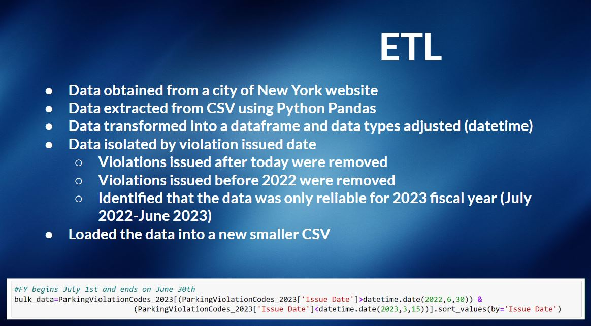
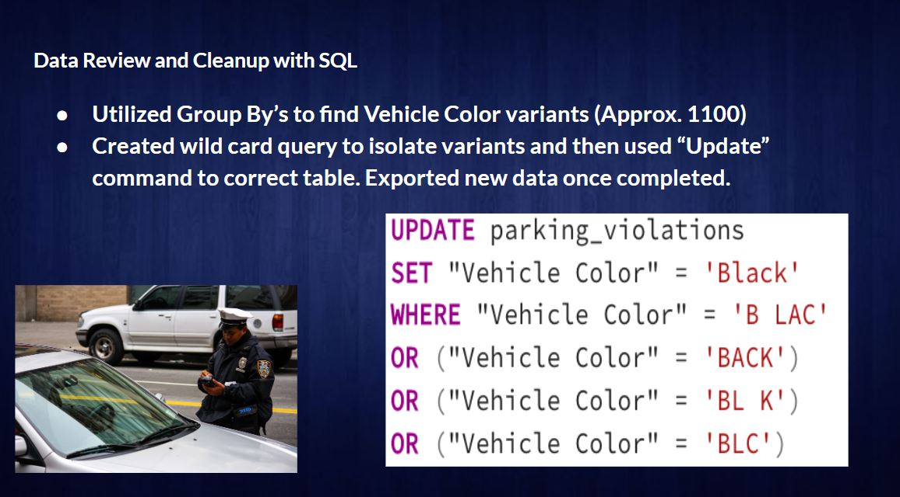
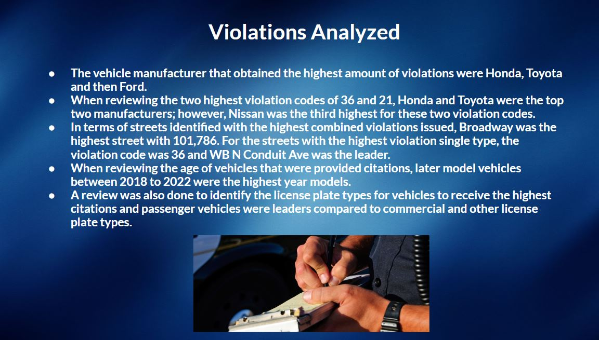
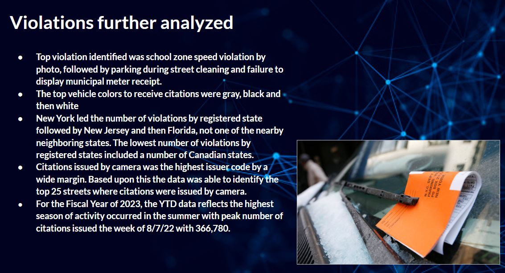
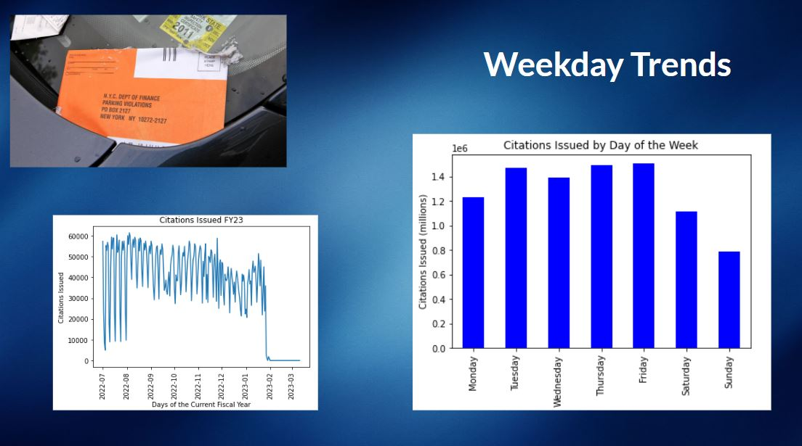
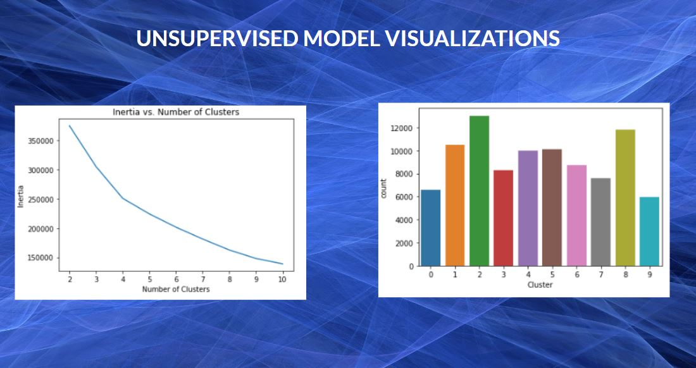
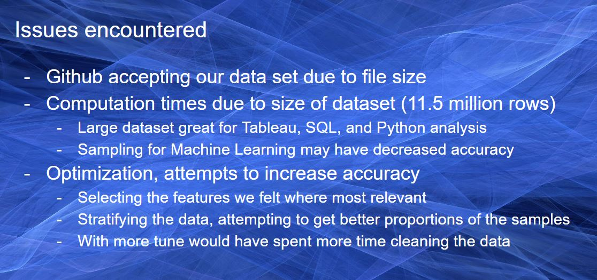

# NYCParkingViolation-analysis

Group 3: Randie S., Tony P., Brinda S., Robert C. and Christian N.
This project is an analysis on vehicle violations in New York city in the most recent fiscal year. These violations include moving and parking violations

Analysis on the data includes:
- Using python and SQL to query the dataset, and create visualizations
- A business intelligence analysis using tableau to identify trends and phenomena in the data
- Unsupervised Machine Learning model to predict probability of being ticketed based off of user input

There is link to the Tableau presentation, along with our dataset as Github was unable to upload them due to their size.

[All Data files for presentation](https://drive.google.com/drive/folders/1hjJyH2syDmBRu-ekDTNM1XPxay9P8_Cn?usp=share_link)

[Tableau link 1](https://public.tableau.com/app/profile/robert.casiano/viz/NYCParkingTickets_16788215474100/NYCParkingViolationsAnalysis?publish=yes) 
[Tableau link 2](https://public.tableau.com/views/NYCproject/Story1?:language=en-US&publish=yes&:display_count=n&:origin=viz_share_link)

## ETL

## Analysis

# Machine Learning

## Demos of Supevised and Unsupervised Machine Learning Models

Demo 1 supervised

Using a python script, we created an “app” that we ran in Anaconda prompt to predict the probability of being ticketed if we have a user input particular features from the dataset.

[Demo 1 unsupervised (video)](https://drive.google.com/file/d/1ePsm7ppJL8XNOuayZjefcO2VggUAK2ja/view?usp=share_link)

We essentially wanted to see if I have a Black Toyota with Jersey plates, and I park on South St… can my model tell me the chances I would could be ticketed?

After running the first instance, I noticed something… my cluster accuracy was 100%, which unfortunately is not typically feasible. I believe the particular challenge in this instance is that my data is too simple. In other words selected features formy analysis are not really representative of the whole dataset, which can result in high accuracy but poor generalization to new data.

The first attempt at this I did unsupervised machine learning. I realized quickly that my model was claiming 100% which isn’t reasonable. As I thought about the exercise, I realized that every single car in this dataset has been ticketed, so it didn’t make sense to me to run it as a supervised model since it’s trained on everything I would ask it. Not really giving a prediction.

[Demo 2 unsupervised (video)](https://drive.google.com/file/d/1nDhUh2j48OemRTX3ozKdOqgniXmJ1ioF/view?usp=share_link)

As you can see we barely get an elbow at 4, and after running a bar plot to show cluster sizes it was uneven. To my understanding, the point of this bar chart is to show if each of the cluster has a similar distribution and mine unfortunately does not.

When we initially went to upload the starter files to the repo, we learned that there is a 100MB limit to the data that could be held within a Github repository. We unsuccessfully attempted a program call Git Large File Storage, feeding in the csv’s from AWS S3 buckets and Google Cloud Storage, even zipping the file and uploading it did not work as it only compressed the file but did not change it’s size. We ultimately placed the data in a Google Drive storage folder and linked it in the repository. This is an issue that granted more time we would look to resolve.
Again with file size, we ran into long compute times whether it was in VS Code, Google Colab, or Databricks. We did use code to take samples of the data, and even attempted to stratify, or make those samples more proportionate. 

There is chance that in our attempts to simplify the data for the sake of compute time, we could have simplified the data too much to get accurate testing. In the supervised model it scored 100% accuracy which is likely overfitting. When the unsupervised model was also getting 100%, it came down to the possibility of our dataset being to simplified.
