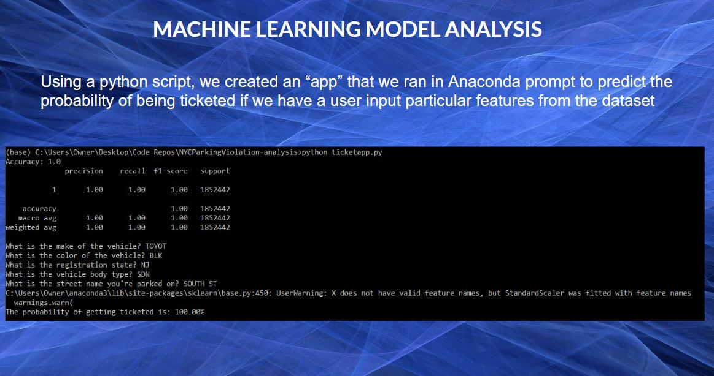

# NYCParkingViolation-analysis

Group 3: Randie S., Tony P., Brinda S., Robert C. and Christian N.
This project is an analysis on vehicle violations in New York city in the most recent fiscal year. These violations include moving and parking violations

Analysis on the data includes:
- Using python and SQL to query the dataset, and create visualizations
- A business intelligence analysis using tableau to identify trends and phenomena in the data
- Unsupervised Machine Learning model to predict probability of being ticketed based off of user input

There is link to the Tableau presentation, along with our dataset as Github was unable to upload them due to their size.

[All Data files for presentation](https://drive.google.com/drive/folders/1hjJyH2syDmBRu-ekDTNM1XPxay9P8_Cn?usp=share_link)

[Tableau link 1](https://public.tableau.com/app/profile/robert.casiano/viz/NYCParkingTickets_16788215474100/NYCParkingViolationsAnalysis?publish=yes) 
[Tableau link 2](https://public.tableau.com/views/NYCproject/Story1?:language=en-US&publish=yes&:display_count=n&:origin=viz_share_link)

## ETL

## Analysis

# Machine Learning

Demo of Unsupervised Model

[label](Pictures/APrompt1.mp4)

[label](Pictures/APrompt2.mp4)